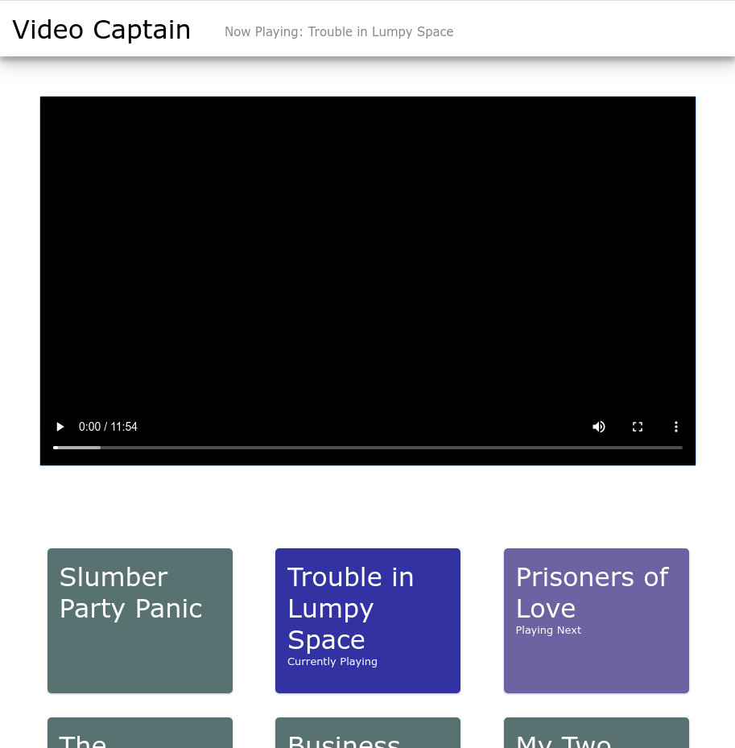

# Video Captain

Serve up a folder of video files for your pleasure of viewing on a locally hosted server.



## Setting up

First, clone the repo onto your machine and install.

```sh
git clone https://github.com/kyle-west/video-captain.git
npm install
```

### Create a `config.js` file

Next, you will need to set up your `config.js` in the root of video captain. For flexibility, you may adjust the location of the config file by setting the `VC_CONFIG` envar to the location of your file.

The file should be of the form:

```js
module.exports = {
  mediaRoot: '/path/to/media/videos/',  // [REQUIRED] path to the root media folder you want to serve videos from
  port: process.env.PORT || 8080,       // [OPTIONAL] the port you want the server to host at (default 5555)
  https: true,                          // [OPTIONAL] use HTTPS instead of HTTP (default false)
  settingsConfig: {                     // [OPTIONAL] make some custom preferences for how the system runs
    clientCanShutdownServer: true,      // allow setting on client side to shutdown server exits with (200) status
  }
}
```

You may also specify a couple callbacks that hook into the life cycle of this app. 
- **`function ready (fullURL)`** receives the following string `http://<ip-address>:<port>` and runs when the server is ready to use
- **`function log (logEntry, timeRecorded)`** receives to strings and can be used to record interesting data for your purposes

```js
const { open } = require('openurl')

module.exports = {
  ready: (fullURL) => {
    open(fullURL) // or whatever is you want
  },
  log: (logEntry, timeRecorded) => {
    console.log(`[${timeRecorded}]: ${logEntry}`) // or write to disk
  },
  ...
}
```

# Best practices for using Video Captain

This program can best be ran by making a runnable script titled `videocaptain` which allows you to bootstrap onto the video captain
life cycle.

In the following example, running `videocaptain` will automatically mount the drive if it is not mounted already, then boot up the 
server. The last bit of this checks makes `videocaptain nighttime` turn off the computer if the client shuts down the server.

```sh
#!/bin/bash

# mount the media drive if it is not already mounted 
if [ ! -d /media/videos ]; then # this is the same path as what is in `config.js`
  echo "Mounting Media Drive at /media"
  sudo mkdir -p /media
  sudo mount /dev/sda5 /media
fi

# go to the local project and run the server
cd ~/dev/video-captain
sudo PORT=80 node server.js # set the port to 80 because we want to host at `http://<computer-name>.local`
if [ $? -eq 200 ] && [ "$1" == "nighttime" ]; then
  echo "The program was shutdown with an exit code of [200], which means that it was shutdown intentionally by the client application"
  echo "Running > shutdown now"
  shutdown now
fi
```

Note that running with `PORT=80` will host on your LAN or WLAN at `http://<your-computer-name>.local`.